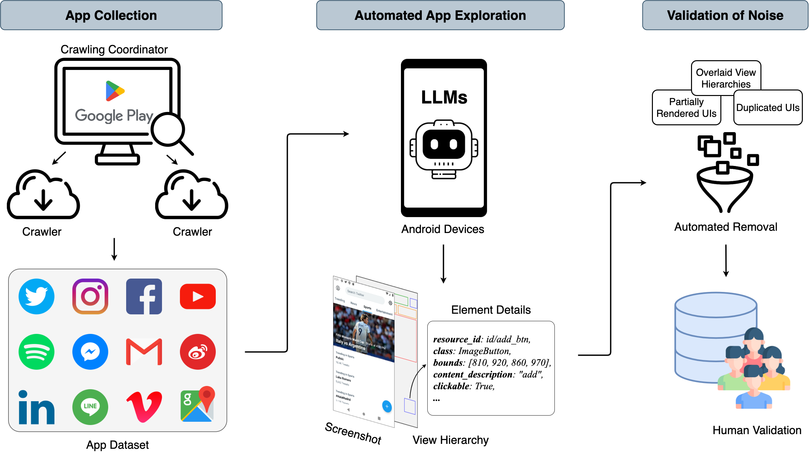

# MUD: Towards a Large-Scale and Noise-Filtered UI Dataset for Modern Style UI Modeling

## Table of Contents
- [Table of Contents](#table-of-contents)
- [Getting Started](#getting-started)
- [Empirical Study](#empirical-study)
    - [Do the apps feature updated UI designs?](#do-the-apps-feature-updated-ui-designs)
    - [What are the prevalent noises in the UI?](#what-are-the-prevalent-noises-in-the-ui)
- [The MUD Dataset](#the-mud-dataset)
    - [Overview](#overview)
    - [Data Analysis](#data-analysis)

## Getting Started
The importance of computational modeling of mobile user interfaces (UIs) is undeniable. However, these require a high-quality UI dataset. Existing datasets are often outdated, collected years ago, and are frequently noisy with mismatches in their visual representation. This presents challenges in modeling UI understanding in the wild. This paper introduces a novel approach to automatically mine UI data from Android apps, leveraging Large Language Models (LLMs) to mimic human-like exploration. To ensure dataset quality, we employ the best practices in UI noise filtering and incorporate human annotation as a final validation step. Our results demonstrate the effectiveness of LLMs-enhanced app exploration in mining more meaningful UIs, resulting in a large dataset MUD of 18k human-annotated UIs from 3.3k apps. We highlight the usefulness of MUD in two common UI modeling tasks: element detection and UI retrieval, showcasing its potential to establish a foundation for future research into high-quality, modern UIs.

## Empirical Study
We chose the Rico dataset as the subject of our study, given its widespread use as a UI dataset. 
We randomly gathered 500 UIs from 27 app categories to form our experimental dataset.

### Do the apps feature updated UI designs?

 

To determine whether the UIs in the Rico dataset have been updated, we compared the UIs to the corresponding latest versions of the apps. We identified four primary types of UI design updates from Rico, as illustrated in Figure. First, the visual appearance of mobile UI is evolving, encompassing aspects such as color, contrast, and element design. Second, improvements in the visual hierarchy are being made to better accommodate human perception within the UI. Third, interactions are being optimized to simplify the user experience, enabling users to complete tasks more quickly and efficiently, thereby boosting user engagement. Lastly, the importance of typography, previously underestimated in the early years, is increasingly recognized.

### What are the prevalent noises in the UI?

 

To examine the extent of noises and errors in the UI datasets, we asked the annotators to label the noisy data in a sample of 500 experimental UIs. Following the Card Sorting method, we identified three prevalent types of noise in the UI datasets: 1) Partially Rendered UIs, 2) Overlaid View Hierarchies, and 3) Duplicated UIs.

## The MUD Dataset

### Overview

 

Upon analyzing 500 UIs from Rico, we found that they are now designed in a more contemporary style. Despite the considerable size of the Rico set, 39% of its UIs are affected by noise, including partially rendered UIs, overlaid view hierarchies, and duplicated UIs. These old-fashioned UI designs and the presence of noise in Rico could significantly impact data-driven modeling in current UI tasks. This underscores the need for a high-quality dataset featuring UIs designed in the new fashion. Therefore, we collect MUD by encouraging Large Language Models (LLMs) to act as app experts and facilitates interactions within the app. The overview of our dataset collection is shown in Figure.
> Please download the UI dataset in the [drive](https://drive.google.com/file/d/1cbTRT3ky_zTveb_NnNPLUO9ZGXHvCcUl/view?usp=sharing)
<!-- > Please download the interaction traces dataset in the [repoistory](https://drive.google.com/file/d/14BJyF-Tr6UykN0rlmLB4qP3CYVUojQ5X/view?usp=sharing) -->

### Data Analysis

 

Our dataset is composed of 3.3k apps spread over 33 different categories as shown in Figure. 
It has the diverse distribution of app categories, covering education, finance, food & drink, etc.
The apps in our dataset have an average download count of 71 million and hold an average rating of 4.17 out of 5.0 stars, emphasizing the popularity and high quality of the apps in our collection.
Our automated app exploration has amassed a collection of 18k UI screenshots, each paired with its corresponding view hierarchy.